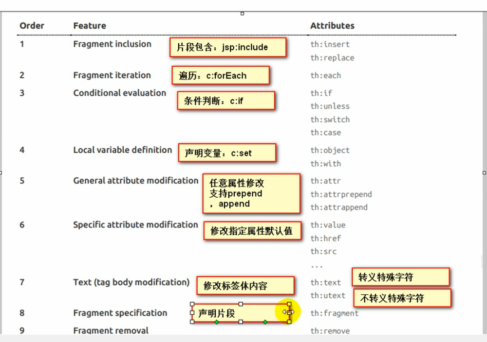
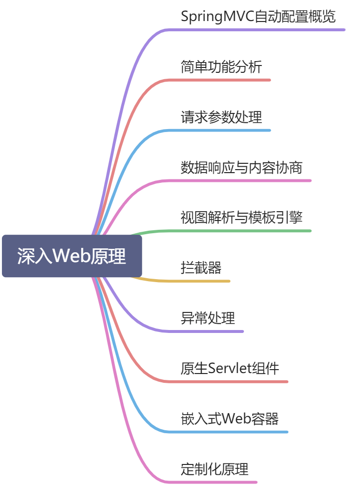
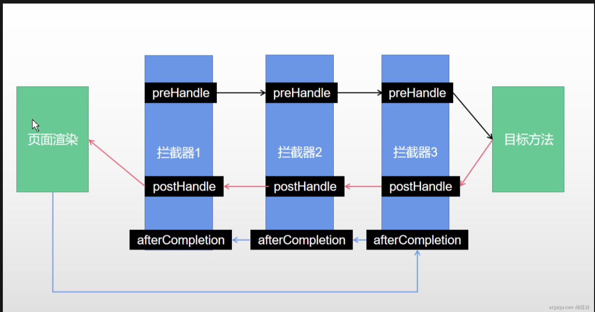
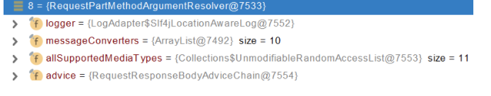
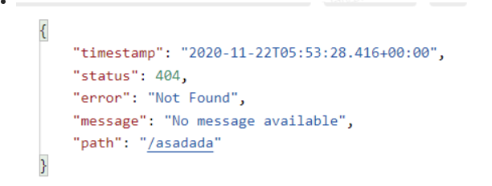
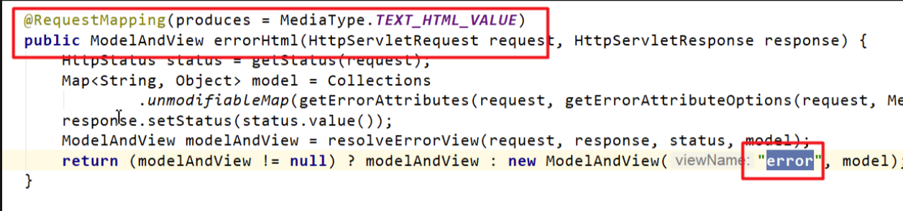
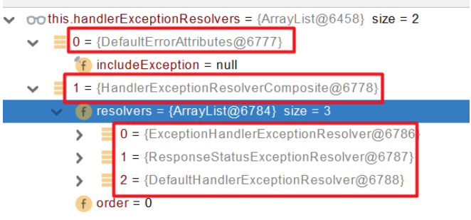

# springboot yaml

## 1.YAML语法:

### 1、基本语法

k:(空格)v:表示一对键值对（需有空格）；

以空格(缩进)来控制层级：左对齐一列数据，属于同一层级

```yaml
server:
	port: 8081
	path: /hello
```

--大小写敏感

### 2、值的写法

**字面量：普通的值（数字，字符串，布尔）**

​		k: v :值

​				字符串默认不加单双引号；

​				“”：双引号，不会转义特殊字符

​				“ ：单引号，会转义

**对象、Map(属性和值)（键值对）：**

​		k: v :在下面一行写对象的属性和值的关系；

```yaml
friend:
	lastname: zhangsan
	age: 20
```

行内写法：

```yaml
friend: {lastname: zhangsan,age: 20}
```

**数组（List、Set）:**

用- 值表示数组中的一个元素

```yaml
pet:
 - cat
 - dog
 - pog
```

行内写法:

```yaml
pet: [dog,cat,pig]
```

### 3.配置文件值注入

#### **1、配置文件**

```yaml
server:
  port:8081

person:
    lastName: zhangsan
    age: 18
    boss: false
    birth: 2017/2/2
    maps: {k1: v1,k2: v2}
    lists:
      - lisi
      - zhaoliu
    dog:
      name: 小狗
      age: 2
```

javaBean ：

```java
/*
* 将配置文件中配置的每一个属性，映射到这个组件中
@ConfigurationProperties:告诉SpringBoot
将本类中的所有属性和配置文件中相关的配置进行绑定；
prefix  = "person":配置文件中哪个下面的所有属性进行一一映射
* */
@Component
@ConfigurationProperties(prefix = "person")
public class Person{

    private String lastName;
    private Integer age;
    private Boolean boss;
    private Date birth;

    private Map<String,Object> maps;
    private List<Object> lists;
    private com.example.Dog dog;

```

需导入配置文件处理器，编写配置便会有提示	

```xml
<dependency>
   <groupId>org.springframework.boot</groupId>
            <artifactId>spring-boot-configuration-processor</artifactId>
     <optional>true</optional>
 </dependency>
```

#### **2、@Value获取值和@ConfigurationProperties获取值比较**

|                                        | @ConfigurationProperties | @Value     |
| -------------------------------------- | ------------------------ | ---------- |
| 功能                                   | 批量注入配置文件中的属性 | 一个个指定 |
| 松散绑定(松散语法) ;last-name lastName | 支持                     | 不支持     |
| SpEL;   Spring语法                     | 不支持                   | 支持       |
| JSR303数据校验                         | 支持                     | 不支持     |
| 复杂类型封装                           | 支持                     | 不支持     |

无论是配置文件yml和properties他们都能获取到值；

如果是在某个业务逻辑中需要获取配置文件中的某项值，使用@Value；

如果是专门写个javaBean来和配置文件进行映射，就直接使用@Configurations;

#### 3、配置文件注入值数据校验

##### @PropertySource&@ImportResource

**@PropertySource : 读取指定的配置文件**

```java
@@PropertySources(value = {"classpath:person.properties"})
```

**@ImportResource** ：导入spring的配置文件，让配置文件的内容生效；

SpringBoot里面没有Spring对的配置文件，自己编写的配置文件，不能够自动识别

``` 
@ImportResource(locations = {"classpath:bean.xml"})
用该注解来导入spring配置文件xml,让其生效
```


！！@Configuration:指明当前类是一个配置类；替代之前的配置文件


SpringBoot推荐给容器中添加组件的方式

1、配置类 ===== Spring配置文件

2、使用@Bean给容器中添加组件

```java
/*
@Configuration:指明当前类是一个配置类； 就是来替代之前的Spring配置文件

	在配置文件中使用<bean></bean>标签添加组件
*/
public class MyAppConfig {

    //将方法的返回值添加到容器中；容器中这个组件默认的id的是方法名
    @Bean
    public HelloServies helloServies(){
        System.out.println("配置类@Bean给容器中添加组件了");
        return new HelloServies();
    }
}
```


# springboot thymeleaf

## thymeleaf


### th ：语法

> 


# springbootweb

## 1、静态资源配置与访问




### 1、SpringMVC自动配置概览

Spring Boot provides auto-configuration for Spring MVC that **works well with most applications.(大多场景我们都无需自定义配置)**

The auto-configuration adds the following features on top of Spring’s defaults:

- Inclusion of `ContentNegotiatingViewResolver` and `BeanNameViewResolver` beans.

- - 内容协商视图解析器和BeanName视图解析器

- Support for serving static resources, including support for WebJars (covered [later in this document](https://docs.spring.io/spring-boot/docs/current/reference/html/spring-boot-features.html#boot-features-spring-mvc-static-content))).

- - 静态资源（包括webjars）

- Automatic registration of `Converter`, `GenericConverter`, and `Formatter` beans.

- - 自动注册 `Converter，GenericConverter，Formatter `

- Support for `HttpMessageConverters` (covered [later in this document](https://docs.spring.io/spring-boot/docs/current/reference/html/spring-boot-features.html#boot-features-spring-mvc-message-converters)).

- - 支持 `HttpMessageConverters` （后来我们配合内容协商理解原理）

- Automatic registration of `MessageCodesResolver` (covered [later in this document](https://docs.spring.io/spring-boot/docs/current/reference/html/spring-boot-features.html#boot-features-spring-message-codes)).

- - 自动注册 `MessageCodesResolver` （国际化用）

- Static `index.html` support.

- - 静态index.html 页支持

- Custom `Favicon` support (covered [later in this document](https://docs.spring.io/spring-boot/docs/current/reference/html/spring-boot-features.html#boot-features-spring-mvc-favicon)).

- - 自定义 `Favicon`  

- Automatic use of a `ConfigurableWebBindingInitializer` bean (covered [later in this document](https://docs.spring.io/spring-boot/docs/current/reference/html/spring-boot-features.html#boot-features-spring-mvc-web-binding-initializer)).

- - 自动使用 `ConfigurableWebBindingInitializer` ，（DataBinder负责将请求数据绑定到JavaBean上）

> If you want to keep those Spring Boot MVC customizations and make more [MVC customizations](https://docs.spring.io/spring/docs/5.2.9.RELEASE/spring-framework-reference/web.html#mvc) (interceptors, formatters, view controllers, and other features), you can add your own `@Configuration` class of type `WebMvcConfigurer` but **without** `@EnableWebMvc`.
>
> **不用@EnableWebMvc注解。使用** **`@Configuration`** **+** **`WebMvcConfigurer`** **自定义规则**


> If you want to provide custom instances of `RequestMappingHandlerMapping`, `RequestMappingHandlerAdapter`, or `ExceptionHandlerExceptionResolver`, and still keep the Spring Boot MVC customizations, you can declare a bean of type `WebMvcRegistrations` and use it to provide custom instances of those components.
>
> **声明** **`WebMvcRegistrations`** **改变默认底层组件**


> If you want to take complete control of Spring MVC, you can add your own `@Configuration` annotated with `@EnableWebMvc`, or alternatively add your own `@Configuration`-annotated `DelegatingWebMvcConfiguration` as described in the Javadoc of `@EnableWebMvc`.
>
> **使用** **`@EnableWebMvc+@Configuration+DelegatingWebMvcConfiguration 全面接管SpringMVC`**


### 2.简单功能分析

#### 2.1静态资源访问

##### 1、静态资源目录

类路径下：called`/static` (or `/public` or `/resources` or `/META-INF/resources`)

访问：项目根路径/+静态资源名

原理：静态映射/**。

请求，先在controller进行处理，不能处理的所有请求交给静态资源处理器


##### 2、静态资源访问前缀

设置

```properties
spring.mvc.static-path-pattern=/resources/**
```

设置静态资源存放路径

```yaml
resources：
	static-localtions:[classpath:/  /]
```


3、webjar

自动映射

https://www.webjars.org/

```xml
<dependency>    
    <groupId>org.webjars</groupId>    
    <artifactId>jquery</artifactId>    
    <version>3.5.1</version> 
</dependency>
```


#### 2.2 welcome page

- 静态资源路径下 index.html
  - 可以配置静态资源路径
  - 不可以配置静态资源的访问前缀，否则会导致index。html不能被默认访问
  - controller 处理index

#### 2.3 自定义Favicon

​	在static目录下放置 

**`	tips`**：

​	注意 缓存


#### 2.4静态资源自动配置

- SpringBoot启动默认加载  xxxAutoConfiguration 类（自动配置类）
- SpringMVC功能的自动配置类 WebMvcAutoConfiguration，生效

```java
@Configuration(proxyBeanMethods = false)
@ConditionalOnWebApplication(type = Type.SERVLET)
@ConditionalOnClass({ Servlet.class, DispatcherServlet.class, WebMvcConfigurer.class })
@ConditionalOnMissingBean(WebMvcConfigurationSupport.class)
@AutoConfigureOrder(Ordered.HIGHEST_PRECEDENCE + 10)
@AutoConfigureAfter({ DispatcherServletAutoConfiguration.class, TaskExecutionAutoConfiguration.class,
        ValidationAutoConfiguration.class })
public class WebMvcAutoConfiguration {}
```


- 容器中配置

```java
 @Configuration(proxyBeanMethods = false)
    @Import(EnableWebMvcConfiguration.class)
    @EnableConfigurationProperties({ WebMvcProperties.class, ResourceProperties.class })
    @Order(0)
    public static class WebMvcAutoConfigurationAdapter implements WebMvcConfigurer {}
```

​    @EnableConfigurationProperties({ WebMvcProperties.class, ResourceProperties.class })

- 配置文件的相关属性与   进行绑定。

  WebMvcProperties--spring mvc

  ResourceProperties--spring resources

##### 1、配置类只有一个有参构造器

```java
    //有参构造器所有参数的值都会从容器中确定
//ResourceProperties resourceProperties；获取和spring.resources绑定的所有的值的对象
//WebMvcProperties mvcProperties 获取和spring.mvc绑定的所有的值的对象
//ListableBeanFactory beanFactory Spring的beanFactory
//HttpMessageConverters 找到所有的HttpMessageConverters
//ResourceHandlerRegistrationCustomizer 找到 资源处理器的自定义器。=========
//DispatcherServletPath  
//ServletRegistrationBean   给应用注册Servlet、Filter....
    public WebMvcAutoConfigurationAdapter(ResourceProperties resourceProperties, WebMvcProperties mvcProperties,
                ListableBeanFactory beanFactory, ObjectProvider<HttpMessageConverters> messageConvertersProvider,
                ObjectProvider<ResourceHandlerRegistrationCustomizer> resourceHandlerRegistrationCustomizerProvider,
                ObjectProvider<DispatcherServletPath> dispatcherServletPath,
                ObjectProvider<ServletRegistrationBean<?>> servletRegistrations) {
            this.resourceProperties = resourceProperties;
            this.mvcProperties = mvcProperties;
            this.beanFactory = beanFactory;
            this.messageConvertersProvider = messageConvertersProvider;
            this.resourceHandlerRegistrationCustomizer = resourceHandlerRegistrationCustomizerProvider.getIfAvailable();
            this.dispatcherServletPath = dispatcherServletPath;
            this.servletRegistrations = servletRegistrations;
        }
```


##### 2. resources 资源 处理

```
spring:
#  mvc:
#    static-path-pattern: /res/**

  resources:
    add-mappings: false   禁用所有静态资源规则
```


##### 3.welcome page  资源处理

```java
    @Bean
        public WelcomePageHandlerMapping welcomePageHandlerMapping(ApplicationContext applicationContext,
                FormattingConversionService mvcConversionService, ResourceUrlProvider mvcResourceUrlProvider) {
            WelcomePageHandlerMapping welcomePageHandlerMapping = new WelcomePageHandlerMapping(
                    new TemplateAvailabilityProviders(applicationContext), applicationContext, getWelcomePage(),
                    this.mvcProperties.getStaticPathPattern());
            welcomePageHandlerMapping.setInterceptors(getInterceptors(mvcConversionService, mvcResourceUrlProvider));
            welcomePageHandlerMapping.setCorsConfigurations(getCorsConfigurations());
            return welcomePageHandlerMapping;
        }

    WelcomePageHandlerMapping(TemplateAvailabilityProviders templateAvailabilityProviders,
            ApplicationContext applicationContext, Optional<Resource> welcomePage, String staticPathPattern) {
        if (welcomePage.isPresent() && "/**".equals(staticPathPattern)) {
            //要用欢迎页功能，必须是/**
            logger.info("Adding welcome page: " + welcomePage.get());
            setRootViewName("forward:index.html");
        }
        else if (welcomeTemplateExists(templateAvailabilityProviders, applicationContext)) {
            // 调用Controller  /index
            logger.info("Adding welcome page template: index");
            setRootViewName("index");
        }
    }
```

- HandlerMapping：处理器映射。保存了每一个Handler能处理哪些请求。  

- 要用欢迎页功能，必须是/**

## 拦截器

### 1.编写一个拦截器

实现HandlerInterceptor接口

```java
/**
 * @Author Robert
 * @create 2020/12/28 10:32
 * @Version 1.0
 * @Description: 登录检查、拦截器
 * 1、配置好拦截器要拦截哪些请求
 * 2、把配置放在容器中
 */
@Slf4j
public class LoginInterceptor implements HandlerInterceptor {

    /**
     * 目标方法执行之前
     * @param request
     * @param response
     * @param handler
     * @return
     * @throws Exception
     */
    @Override
    public boolean preHandle(HttpServletRequest request, HttpServletResponse response, Object handler) throws Exception {

        String requestURI = request.getRequestURI();
        log.info("拦截的请求路径为{}",requestURI);
        HttpSession session = request.getSession();

        Object loginUser = session.getAttribute("loginUser");

        if(loginUser != null){
            //放行
            return true;
        }
        //拦截  /未登录 跳转到登录页面
        //添加msg信息
        request.setAttribute("msg","please login first");
        //重定向 到 登录页面 并将msg信息返回
//        response.sendRedirect("/");
        request.getRequestDispatcher("/").forward(request,response);
        return false;
    }

    /**
     * 目标方法执行之后
     * @param request
     * @param response
     * @param handler
     * @param modelAndView
     * @throws Exception
     */
    @Override
    public void postHandle(HttpServletRequest request, HttpServletResponse response, Object handler, ModelAndView modelAndView) throws Exception {

    }


    /**
     * 页面渲染以后
     * @param request
     * @param response
     * @param handler
     * @param ex
     * @throws Exception
     */
    @Override
    public void afterCompletion(HttpServletRequest request, HttpServletResponse response, Object handler, Exception ex) throws Exception {

    }
}
```


### 2.拦截器注册到容器中

- 实现WebMvcConfigurer的addInterceptors

```java
@Configuration
public class AdminWebConfig implements WebMvcConfigurer {

    @Override
    public void addInterceptors(InterceptorRegistry registry) {
        //添加一个拦截器
        registry.addInterceptor(new LoginInterceptor())
                .addPathPatterns("/**")//默认为拦截所有请求  也会把所有的静态资源请求给拦截
                .excludePathPatterns("/","/login","/css/**","/fonts/**","/images/**","/js/**");//放行哪些请求
    }
}
```


### 3. 指定拦截规则

- 【如果是拦截所有请求，那么静态资源请求也会被拦截】

```java
registry.addInterceptor(new LoginInterceptor())
        .addPathPatterns("/**")//默认为拦截所有请求  也会把所有的静态资源请求给拦截
        .excludePathPatterns("/","/login","/css/**","/fonts/**","/images/**","/js/**");//放行哪些请求
```


### 4.拦截器原理

1、根据当前请求，找到**HandlerExecutionChain【**可以处理请求的handler以及handler的所有 拦截器】

2、先来**顺序执行** 所有拦截器的 preHandle方法

- 如果当前拦截器prehandler返回为true。则执行下一个拦截器的preHandle
- 如果当前拦截器返回为false。直接   倒序执行所有已经执行了的拦截器的  afterCompletion；

**3、如果任何一个拦截器返回false。直接跳出不执行目标方法**

**4、所有拦截器都返回True。执行目标方法**

**5、倒序执行所有拦截器的postHandle方法。**

**6、前面的步骤有任何异常都会直接倒序触发** afterCompletion

7、页面成功渲染完成以后，也会倒序触发 afterCompletion



- 中间只要有一个preHandle 处理错误都会直接在该拦截器afterCompletion触发


## 文件上传

### 1. 页面表单

```html
<form method="post" action="/upload" enctype="multipart/form-data">
    <input type="file" name="file"><br>
    <input type="submit" value="提交">
</form>
```

### 2.文件上传核心

```java
    /**
     * MultipartFile 自动封装上传过来的文件
     * @param email
     * @param username
     * @param headerImg
     * @param photos
     * @return
     */
    @PostMapping("/upload")
    public String upload(@RequestParam("email") String email,
                         @RequestParam("username") String username,
                         @RequestPart("headerImg") MultipartFile headerImg,
                         @RequestPart("photos") MultipartFile[] photos) throws IOException {
        //获取前端传入的文件
        log.info("上传的信息：email={}，username={}，headerImg={}，photos={}",
                email,username,headerImg.getSize(),photos.length);
//        判断个人图片是否为空 传入E盘
        if(!headerImg.isEmpty()){
            String originalFilename = headerImg.getOriginalFilename();
            headerImg.transferTo(new File("E:\\cache\\"+originalFilename));
        }

        if (photos.length >0){//判断长度
            for (MultipartFile photo : photos) {//遍历放入
                String originalFilename = photo.getOriginalFilename();
                photo.transferTo(new File("E:\\cache\\"+originalFilename));

            }
        }
        return "main";

    }
```


### 3. 自动配置原理

**文件上传自动配置类-MultipartAutoConfiguration-MultipartProperties**

- 自动配置好了 **StandardServletMultipartResolver  【文件上传解析器】**
- **原理步骤**
  - **1、请求进来使用文件上传解析器判断（**isMultipart**）并封装（**resolveMultipart，**返回**MultipartHttpServletRequest**）文件上传请求**
  - **2、参数解析器来解析请求中的文件内容封装成MultipartFile**
  - **3、将request中文件信息封装为一个Map；**MultiValueMap<String, MultipartFile>



***tips：***

​	**FileCopyUtils**。实现文件流的拷贝


## 异常处理

### 1.错误处理

#### 1、默认规则

> - 默认情况下，Spring Boot提供`/error`处理所有错误的映射
> - 对于机器客户端，它将生成JSON响应，其中包含错误，HTTP状态和异常消息的详细信息。对于浏览器客户端，响应一个“ whitelabel”错误视图，以HTML格式呈现相同的数据
>
> 
>
> - **要对其进行自定义，添加****`View`****解析为`error```**
> - 要完全替换默认行为，可以实现 `ErrorController `并注册该类型的Bean定义，或添加`ErrorAttributes类型的组件`以使用现有机制但替换其内容。
> - error/下的4xx，5xx页面会被自动解析


#### 2、定制错误处理逻辑

- 自定义错误页
- - error/404.html  error/5xx.html；有精确的错误状态码页面就匹配精确，没有就找 4xx.html；如果都没有就触发白页
- @ControllerAdvice+@ExceptionHandler处理全局异常；底层是 **ExceptionHandlerExceptionResolver 支持的**
- @ResponseStatus+自定义异常 ；底层是 **ResponseStatusExceptionResolver ，把responsestatus注解的信息底层调用** **response.sendError(statusCode, resolvedReason)；tomcat发送的/error**
- Spring底层的异常，如 参数类型转换异常；**DefaultHandlerExceptionResolver 处理框架底层的异常。**
- - response.sendError(HttpServletResponse.**SC_BAD_REQUEST**, ex.getMessage());
- 自定义实现 HandlerExceptionResolver 处理异常；可以作为默认的全局异常处理规则

- - 

- **ErrorViewResolver**  实现自定义处理异常；
- - response.sendError 。error请求就会转给controller
  - 你的异常没有任何人能处理。tomcat底层 response.sendError。error请求就会转给controller
  - **basicErrorController 要去的页面地址是** **ErrorViewResolver**  ；


#### 3、异常处理自动配置原理

- **ErrorMvcAutoConfiguration  自动配置异常处理规则**

  - **容器中的组件**：类型：**DefaultErrorAttributes**-> **id：errorAttributes**

    - **public class** **DefaultErrorAttributes** **implements** **ErrorAttributes**, **HandlerExceptionResolver**
    - **DefaultErrorAttributes**：定义错误页面中可以包含哪些数据。

    

- - **容器中的组件：类型：****BasicErrorController --> id：basicErrorController（json+白页 适配响应）**

- - - **处理默认** **/error 路径的请求；页面响应** **new** ModelAndView(**"error"**, model)；
    - **容器中有组件 View**->**id是error**；（响应默认错误页）
    - 容器中放组件 **BeanNameViewResolver（视图解析器）；按照返回的视图名作为组件的id去容器中找View对象。**

  - 

- - **容器中的组件：**类型：**DefaultErrorViewResolver -> id：**conventionErrorViewResolver

- - - 如果发生错误，会以HTTP的状态码 作为视图页地址（viewName），找到真正的页面
    - error/404、5xx.html


-- 如果要返回页面；就会找error视图【StaticView】（默认是白页）




去错误页


#### 4、异常处理步骤流程

1、执行目标方法，目标方法运行期间有任何异常都会被catch、而且标志当前请求结束；并且用 **dispatchException** 

2、进入视图解析流程（页面渲染）

​	processDispatchResult(processedRequest, response, mappedHandler, **mv**, ***dispatchException***);

3、**mv** = **processHandlerException**；处理handler发生的异常，处理完成返回ModelAndView；mv ModelAndView

- 1、遍历所有的**handlerExceptionResolvers**，看谁能处理当前异常***【HandlerExceptionResolver处理器异常解析器】***
- **2、系统默认的  异常解析器；**



- - **1、DefaultErrorAttributes先来处理异常。把异常信息保存到rrequest域，并且返回null；**
  - **2、默认没有任何人能处理异常，所以异常会被抛出**

- - - **1、如果没有任何人能处理最终底层就会发送 /error 请求。会被底层的BasicErrorController处理**

    - **2、解析错误视图；遍历所有的**  **ErrorViewResolver  看谁能解析。**

    - ****

    - **3、默认的** **DefaultErrorViewResolver ,作用是把响应状态码作为错误页的地址，error/500.html** 

    - **4、模板引擎最终响应这个页面** **error/500.html** 

      

## Web原生组件注入

***（Servlet，Filter，Listener）***

### 1、使用Servlet API


> ```
> //配置需要扫描的servlet包 
> @ServletComponentScan(basePackages = "com.geek")
> ```
>
> - 指定原生servlet组件都放在哪里


> ```
> @WebServlet(urlPatterns = "/my")//配置servlet请求路径
> ```
>
> - 效果：直接响应，没有经过spring的拦截器


> ```
> //@WebFilter(urlPatterns = "/")//可以配置想要拦截的路径
> ```
>
> - filter 


> ```
> @WebListener
> ```
>
> - WebListener


扩展：DispatchServlet 如何注册进来

- 容器中自动配置了  DispatcherServlet  属性绑定到 WebMvcProperties；对应的配置文件配置项是 **spring.mvc。**
- **通过** **ServletRegistrationBean**<DispatcherServlet> 把 DispatcherServlet  配置进来。
- 默认映射的是 / 路径。


Tomcat-Servlet；

多个Servlet都能处理到同一层路径，精确优选原则

A： /my/

B： /my/1


### 2、使用RegistrationBean

**ServletRegistrationBean**`, `**FilterRegistrationBean**`, and `**ServletListenerRegistrationBean**


```java
@Configuration(proxyBeanMethods = true)
public class MyRegistConfig {

    @Bean
    public ServletRegistrationBean myServlet(){
        MyServlet myServlet = new MyServlet();

        return new ServletRegistrationBean(myServlet,"/my","/my02");
    }

    @Bean
    public FilterRegistrationBean myFilter(){
        MyFilter myFilter = new MyFilter();
        FilterRegistrationBean filterRegistrationBean = new FilterRegistrationBean(myFilter);
        filterRegistrationBean.setUrlPatterns(Arrays.asList("/my","/css/*"));
        return filterRegistrationBean;
    }
    @Bean
    public ServletListenerRegistrationBean myListener(){
        MyServletContextListener myServletContextListener = new MyServletContextListener();
        return new ServletListenerRegistrationBean(myServletContextListener);

    }
}
```

- 在容器中使用RegistrationBean组件、

`tips：`

- ```java
  @Configuration(proxyBeanMethods = true)//保证依赖的组件是单实例的
  ```


## 嵌入式Servlet容器

### 1、切换嵌入式Servlet容器

- 默认支持的webServer

- - `Tomcat`, `Jetty`, or `Undertow`
  - `ServletWebServerApplicationContext 容器启动寻找ServletWebServerFactory 并引导创建服务器`

- 原理
  - SpringBoot应用启动发现当前是Web应用。web场景包-导入tomcat
  - web应用会创建一个web版的ioc容器 `ServletWebServerApplicationContext` 
  - **ServletWebServerApplicationContext**启动的时候寻找 **ServletWebServerFactory**（Servlet 的web服务器工厂---> Servlet 的web服务器）
  - 底层直接会有一个自动配置类。`ServletWebServerFactoryAutoConfiguration`
  - `ServletWebServerFactoryAutoConfiguration`导入了`ServletWebServerFactoryConfiguration`（配置类）
  - `ServletWebServerFactoryConfiguration`（配置类）根据动态判断系统中到底导入了那个Web服务器的包。（默认是web-starter导入tomcat包），容器中就有 `TomcatServletWebServerFactory`
  - `TomcatServletWebServerFactory` 创建出Tomcat服务器并启动；TomcatWebServer 的构造器拥有初始化方法initialize---this.tomcat.start();
  - 内嵌服务器，就是手动把启动服务器的代码调用（tomcat核心jar包存在）


# springboot 数据访问

## 1、SQL

### 1、数据源的自动配置